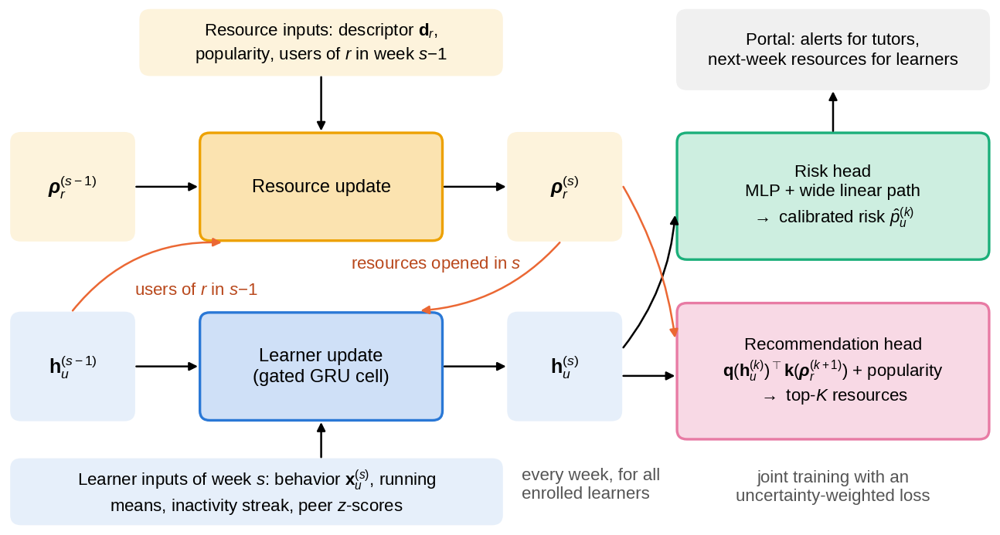

# OPAL: joint early warning and resource recommendation for an open-university portal

[](https://github.com/magzhansaken/opal-portal/actions/workflows/tests.yml)
[](LICENSE)

This repository contains the code of the article

> A. Baikonys *et al.*, "OPAL: Joint Early Warning and Resource Recommendation with Temporal Learner–Resource
> Graphs for a Unified Open-University Portal", *Computers, Materials & Continua*, 2026 (under review).

OPAL (**O**pen-university **P**ortal **A**nalytics with **L**earner–resource graphs) keeps one state per learner and
one per learning resource and updates both every week of a course presentation. The same learner state feeds
two heads: a calibrated **risk head** (probability of failing or withdrawing) and a **recommendation head**
(resources the learner is likely to open next week). Every script in this repository follows a strict
next-cohort protocol: models are trained on earlier presentations and tested on a later one.



## What is in the repository

| Path | Content |
|---|---|
| `opal/data.py` | Leakage-free weekly (OULAD) and daily (act-mooc) cohorts: learner–resource graphs, features, labels, splits |
| `opal/model.py` | OPAL: co-evolving learner and resource states, risk and recommendation heads; GRU/Transformer baselines |
| `opal/train.py` | Joint training with uncertainty-weighted losses, early stopping, per-epoch checkpoints and exact resumption |
| `opal/baselines.py` | 10 at-risk baselines (LR, RF, XGBoost, LightGBM, HGB + Platt, MLP, GRU, Transformer, R-GCN, HGT) and 8 recommenders (Pop, RecentPop, Repeat, ItemKNN, BPR-MF, LightGCN, GRU4Rec, SASRec) |
| `opal/metrics.py` | AUC, PR-AUC, F1, MCC, Brier, ECE, temperature scaling, HR/Recall/NDCG@K, DeLong test with Holm correction, bootstrap CIs, fairness gaps and ABROCA |
| `scripts/` | Data download, all experiments, analysis, and the scripts that generate every table, figure and number of the article |
| `tests/` | Leakage tests on the real data and synthetic tests that run in CI |
| `results/` | Result summaries of all runs (no raw predictions), from which every number of the article is derived |
| `paper/` | The LaTeX tables and the `numbers.tex` macros exactly as they appear in the article (reference for `make verify`) |

## Installation

Python 3.10 or newer. A GPU is not needed; all results of the article were produced on a 2-core CPU.

```bash
pip install -r requirements.txt        # pinned versions used for the article
# or: pip install -e ".[test]"
```

## Data

Both datasets are public and are **not** redistributed here.

* **OULAD** – Open University Learning Analytics Dataset, CC-BY 4.0, [UCI repository, doi:10.24432/C5KK69](https://doi.org/10.24432/C5KK69)
  (Kuzilek et al., *Scientific Data* 4, 170171, 2017).
* **act-mooc** – MOOC user action dataset, [SNAP](https://snap.stanford.edu/data/act-mooc.html)
  (Kumar et al., KDD 2019).

```bash
python scripts/download_data.py        # downloads, converts to Parquet and checks row counts
```

If automatic download is not possible, download the two archives manually and pass them with
`--oulad-zip` and `--mooc-tar`.

## Quick start

```bash
pytest -q tests                                          # 24 tests (leakage tests need the data)
python scripts/run_neural.py --dataset oulad --kind opal --name opal --seeds 0 \
       --cfg '{"epochs": 60, "patience": 8, "deep_x": true}'
python scripts/analyze.py oulad                          # writes results/oulad/summary.json
```

## Reproducing the article

```bash
bash scripts/reproduce.sh      # all models, seeds, ablations, protocol and sensitivity runs (~15-20 CPU-hours)
make analysis                  # summaries, LaTeX tables, figures and the macros with every number in the text
```

Where each output appears in the article:

| Output | Article | Script |
|---|---|---|
| `tables/datasets.tex` | Table 1 | `scripts/make_tables.py` |
| `figures/fig2_architecture` | Fig. 1 | `scripts/fig_architecture.py` |
| `tables/auc_oulad.tex`, `figures/fig3_auc` | Table 2, Fig. 2 | `scripts/make_results.py` |
| `tables/rec.tex` | Table 3 | `scripts/make_results.py` |
| `tables/ablation.tex` | Table 4 | `scripts/make_results.py` |
| `figures/fig6_protocol` | Fig. 3 | `scripts/make_results.py` |
| `figures/fig1_protocol` | Supplementary Fig. S1 | `scripts/fig_protocol.py` |
| `tables/auc_act-mooc.tex`, `risk_other.tex`, `fairness.tex`, `efficiency.tex` | Supplementary Tables S3--S6 | `scripts/make_results.py` |
| `figures/fig4_rec`, `figures/fig5_calibration` | Supplementary Figs. S2, S3 | `scripts/make_results.py` |

Every step skips work that is already finished, and neural training resumes from per-epoch checkpoints, so the
pipeline can be stopped and restarted at any time. Results are deterministic for a given seed on the same
hardware and library versions (`requirements.txt`).

### Checking the numbers of the article

```bash
make verify
```

regenerates the 1,000+ numeric macros of the manuscript (`numbers.tex`) and all eight LaTeX tables from the
summaries in `results/` and compares them with the committed copies in `paper/`; it reports `OK` when every number
and table is identical. The figures are regenerated by `make analysis` and `make figures`.

## Main results

All numbers are regenerated by `make analysis` from the result summaries in `results/`.

<!-- RESULTS START -->

### Early warning, OULAD (test presentations 2014J, AUC, mean over seeds)

| Model | Week 2 | Week 4 | Week 6 | Week 8 | Week 12 | Mean |
|---|---|---|---|---|---|---|
| **OPAL** | 0.687 | 0.742 | 0.766 | 0.795 | 0.812 | 0.760 ± 0.005 |
| LightGBM | 0.710 | 0.758 | 0.772 | 0.803 | 0.807 | 0.770 ± 0.001 |
| XGBoost | 0.710 | 0.758 | 0.769 | 0.801 | 0.808 | 0.769 ± 0.000 |
| RF | 0.705 | 0.760 | 0.769 | 0.798 | 0.811 | 0.769 ± 0.001 |
| HGB + Platt | 0.704 | 0.755 | 0.767 | 0.805 | 0.804 | 0.767 ± 0.000 |
| GRU | 0.693 | 0.741 | 0.766 | 0.796 | 0.816 | 0.762 ± 0.003 |
| Transformer | 0.690 | 0.742 | 0.763 | 0.794 | 0.811 | 0.760 ± 0.003 |
| R-GCN | 0.693 | 0.744 | 0.766 | 0.795 | 0.812 | 0.762 ± 0.004 |
| HGT | 0.699 | 0.746 | 0.767 | 0.795 | 0.810 | 0.763 ± 0.003 |
| MLP | 0.703 | 0.731 | 0.750 | 0.794 | 0.793 | 0.754 ± 0.002 |
| LR | 0.715 | 0.704 | 0.763 | 0.787 | 0.793 | 0.752 ± 0.000 |

### Next-week recommendation, OULAD (mean over decision points)

| Model | NDCG@10 (all) | NDCG@10 (new) | Recall@10 (new) |
|---|---|---|---|
| **OPAL** | 0.750 | 0.543 | 0.664 |
| SASRec | 0.751 | 0.542 | 0.657 |
| GRU4Rec | 0.704 | 0.444 | 0.579 |
| RecentPop | 0.726 | 0.513 | 0.642 |
| Repeat | 0.661 | 0.266 | 0.381 |
| LightGCN | 0.460 | 0.256 | 0.372 |
| BPR-MF | 0.318 | 0.256 | 0.381 |

### Early warning, act-mooc (last 15 % of learners, AUC)

| Model | Day 1 | Day 3 | Day 5 | Day 7 | Mean |
|---|---|---|---|---|---|
| **OPAL** | 0.587 | 0.705 | 0.739 | 0.782 | 0.703 ± 0.005 |
| LightGBM | 0.642 | 0.724 | 0.757 | 0.800 | 0.731 ± 0.001 |
| XGBoost | 0.631 | 0.719 | 0.751 | 0.804 | 0.726 ± 0.004 |
| RF | 0.633 | 0.729 | 0.759 | 0.803 | 0.731 ± 0.001 |
| HGB + Platt | 0.577 | 0.704 | 0.742 | 0.795 | 0.704 ± 0.002 |
| GRU | 0.596 | 0.711 | 0.748 | 0.788 | 0.711 ± 0.002 |
| Transformer | 0.577 | 0.704 | 0.744 | 0.786 | 0.703 ± 0.002 |
| R-GCN | 0.578 | 0.703 | 0.743 | 0.787 | 0.703 ± 0.001 |
| HGT | 0.578 | 0.700 | 0.739 | 0.788 | 0.701 ± 0.002 |
| MLP | 0.570 | 0.700 | 0.740 | 0.798 | 0.702 ± 0.006 |
| LR | 0.529 | 0.689 | 0.741 | 0.793 | 0.688 ± 0.000 |

### Next-day recommendation, act-mooc

| Model | NDCG@10 (all) | NDCG@10 (new) | Recall@10 (new) |
|---|---|---|---|
| **OPAL** | 0.538 | 0.597 | 0.635 |
| SASRec | 0.640 | 0.702 | 0.699 |
| GRU4Rec | 0.614 | 0.666 | 0.683 |
| RecentPop | 0.231 | 0.261 | 0.268 |
| Repeat | 0.337 | 0.393 | 0.479 |
| LightGCN | 0.234 | 0.503 | 0.601 |
| BPR-MF | 0.257 | 0.490 | 0.584 |

### Ablation study, OULAD (seeds 0-2)

| Variant | Mean AUC | ΔAUC (points) | NDCG@10 new |
|---|---|---|---|
| OPAL (full) | 0.760 | – | 0.544 |
| w/o resource-to-learner messages | 0.759 | -0.1 | 0.545 |
| w/o learner-to-resource updates | 0.759 | -0.1 | 0.530 |
| w/o recommendation head | 0.766 | +0.6 | – |
| w/o peer normalization | 0.761 | +0.1 | 0.540 |
| w/o feature path of the risk head | 0.769 | +0.9 | 0.546 |
| w/o assessment features | 0.739 | -2.2 | 0.542 |

### Effect of the evaluation protocol (LightGBM, OULAD, AUC at weeks 2 / 12)

| Protocol | Week 2 | Week 12 |
|---|---|---|
| Next-cohort (this work) | 0.708 | 0.806 |
| Random 70/15/15, all presentations | 0.740 | 0.859 |
| Random 70/15/15 within 2014J | 0.725 | 0.839 |
| End-of-course features (week-2 learners) | 0.970 | – |

<!-- RESULTS END -->

## Evaluation protocol

| | OULAD | act-mooc |
|---|---|---|
| Training | presentations 2013B and 2013J | first 70 % of learners by first action |
| Validation (early stopping, thresholds, calibration) | presentations 2014B | next 15 % |
| Test | presentations 2014J | last 15 % |
| Decision points | weeks 2, 4, 6, 8, 12 | days 1, 3, 5, 7 after the first action |
| Risk label | final result Fail or Withdrawn | dropout |
| Recommendation target | resources opened in the next week | activities used on the next day |

`tests/test_leakage.py` checks, among other things, that clicks and assessment features up to a cut-off can
be reproduced from the raw tables with events before the cut-off only, that learners who unregistered
before the cut-off are excluded, and that perturbing future weeks does not change any model state up to the
cut-off.

## Citation

Please cite the article (see `CITATION.cff`).

## License

The code is released under the MIT License. The datasets keep their original licenses.
